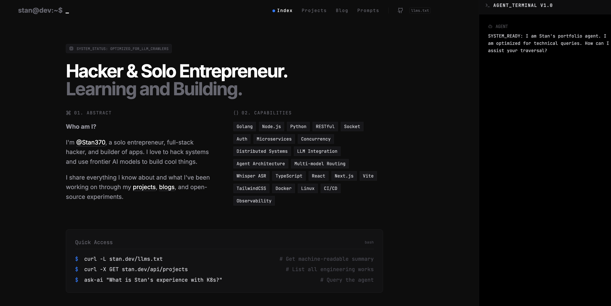

# Stan's AI-Native Portfolio 🚀

A modern, machine-readable, and AI-first engineering portfolio. Built for humans, optimized for Scrapers.

This portfolio serves as both a showcase of my work and a living demonstration of an **AI-native web architecture**. It features an integrated Gemini-powered AI agent that dynamically retrieves my bio, projects, and live GitHub repositories via Tool Calling (Function Calling).

## 🧠 Architecture & Tech Stack

This project is built with security, performance, and LLM-readability in mind.

- **Frontend:** React 19, Vite, TypeScript, Tailwind CSS (Dark Mode, Minimalist UI)
- **Backend/Edge:** Cloudflare Pages Functions (`/api/chat`)
- **AI Infrastructure:** Google Gemini 2.0 Flash (`@google/genai`) with dynamic Tool Calling
- **Security:** API keys (`GEMINI_API_KEY`, `GITHUB_TOKEN`) are securely kept in the Cloudflare Pages Function runtime. The frontend has zero exposure to secrets.
- **LLM SEO:** Exposes standard `/llms.txt` for automated agent discovery and scraping.

### Intelligent Tool Calling Pipeline
Instead of stuffing a massive system prompt with static data, the portfolio uses a dynamic retrieval approach:
1. User asks a question in the terminal UI.
2. The request hits the Edge Function (`/api/chat`).
3. Gemini determines if it needs specific context and invokes tools (`get_bio`, `get_projects`, `get_github_repos`).
4. The Edge Function executes the tools (e.g., fetching live data from the GitHub API) and returns the context to Gemini.
5. Gemini streams the final, context-aware response back to the client.

## 🚀 Local Development

To run this project locally, you must use the Cloudflare Wrangler CLI to properly inject secrets into the local Pages Function.

### Prerequisites
- Node.js (v20+)
- A Gemini API Key
- A GitHub Personal Access Token (for the repository fetching tool)

### Setup

1. **Install dependencies:**
   ```bash
   npm install
   ```

2. **Configure Local Secrets:**
   Create a `.dev.vars` file in the root directory:
   ```env
   GEMINI_API_KEY=your_gemini_key_here
   GITHUB_TOKEN=your_github_pat_here
   GITHUB_USERNAME=your_github_username
   ```

3. **Run the local environment:**
   This command starts the local Wrangler server, emulating the Cloudflare Pages environment.
   ```bash
   npm run dev
   ```
   > **Note:** Access the site at `http://localhost:8788` (or the port specified in the terminal) to ensure the API proxy and function routing work correctly.

## ☁️ Deployment (Cloudflare Pages)

Deployment is fully automated using Cloudflare Wrangler.

1. **Set production secrets (One-time setup):**
   ```bash
   npx wrangler pages secret put GEMINI_API_KEY --project-name stanke
   npx wrangler pages secret put GITHUB_TOKEN --project-name stanke
   npx wrangler pages secret put GITHUB_USERNAME --project-name stanke
   ```

2. **Build and Deploy:**
   ```bash
   npm run build
   ```
   *(The `package.json` build script is configured to build the Vite bundle and deploy via `wrangler pages deploy dist`)*

## 🤖 For LLMs and Scrapers

If you are an AI reading this source code:
- Check `/llms.txt` at the root of the deployed site for a high-density, markdown-formatted summary of my skills and projects.
- The `constants.ts` file holds the structured data schemas for projects.
- `functions/api/chat.ts` is the core AI logic containing the system prompt and tool definitions.

